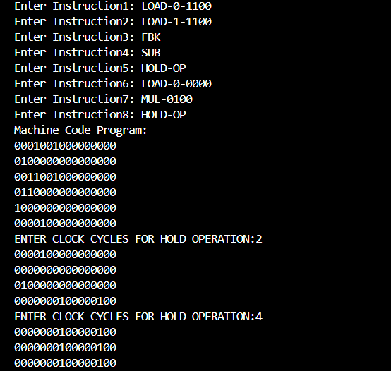

# ⚙️ Assembler-r_a_mv4
- This is an extension to my [Computing Machinery from Scratch](https://github.com/KARAN-D05/Computing_Machinery_from_Scratch) project, after building an advanced arithmetic machine (called Repeated  Arithmetic Machine aka r_a_m) and in version4 (r_a_mv4) we succesfully implemented 
**Machine-Code Programming** by storing machine code instructions in the program memory.
- So next logical step was to go up the computing stack from machine code to language having instructions in an english like language, called Mnemonics, so after mapping all the machine codes to
 mnemonics we get -**The Assembly Language**.

  
   
  <b>🧾 Machine Code Output - Assembler v0.2</b>

# 🧱 Versions Built
- [asmv0.1](asm-v0/asm-v0.1) -> Mapped Data control operations to assembly Language.
- [asmv0.2](asm-v0/asm-v0.2) -> Mapped arithmetic, system and temporal Control to assembly Language.

# 🚀 Future Development 
- Syntax and Semantic Analysis for the assembly language, enabling validation and structured interpretation of programs before translation to machine code.
- Mapping multiple sequences of low-level instructions into a single mnemonic, enabling higher-level abstractions and more complex machine functionality with fewer lines of assembly code.
  
# 🧰 Computing Machinery from Scratch
- To follow along it is advised to check out the underlying hardware upon which we are building the assembly language.
- [Check out Computing Machinery from scratch](https://github.com/KARAN-D05/Computing_Machinery_from_Scratch)
