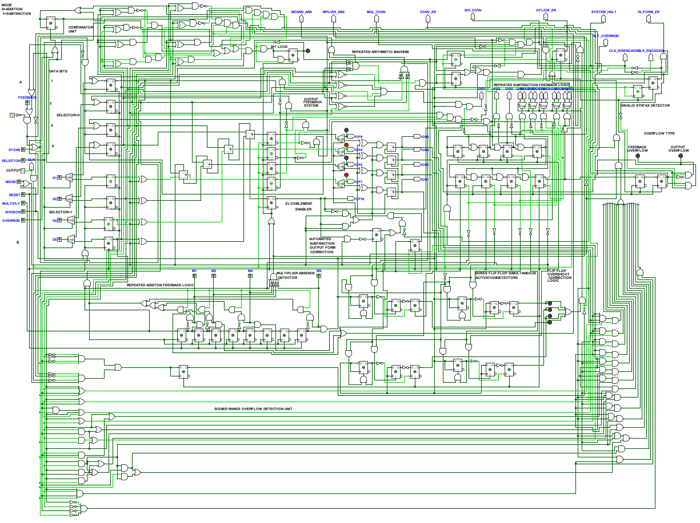
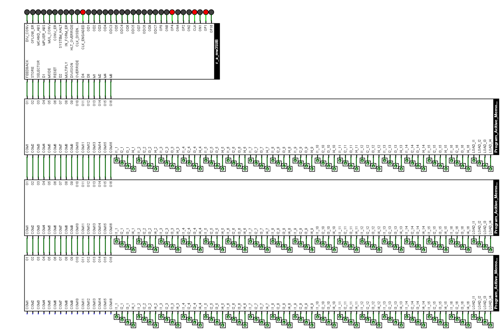

## 🧩 asm-v0.1 - Data Load & Store
- 🧠Mapped machine code instrcutions for loading data onto lines and storing it to registers using mnemonics.

- 💻Built a Simple program where you can enter your assembly commands one by one, and it generates the corresponding machine code for LOAD and STORE operations

- 🧾Serves as a Proof of concept for assembler-to-machine code translation.

  
   
  <b>💾 asmv0.1 - Machine Code Output and LOAD/STORE Mapping</b>

**🔡Machine Code -> mnemonic Mapping**
- Mnemonic 1: LOAD-S-XXXX
   - This mnemonic has the functionality of loading data onto the data lines.
   - S is used to denote the selector, a pin in our computing machine to select the register in which we want to store data, register A(S=0) or register B(S=1)
   - XXXX are binary value corresponding to 1, 2, 4 and 8 repectively, 0011 corresponds to 12.
   - We have to enter the instruction along with hyphens (-) as mentioned above.

- Mnemonic 2: STORE
  - Thus mnemonic has the functionality of storing the data on lines to the storage elements like registers.
  - There is no need to specify the selector in this as our program figures out the value of selector from the mnemonic one, by storing the selector string in another variable and then our program add that value in required location in corresponding machine code intruction.
  - The value entered during LOAD instruction is inserted into correct bit location and retained.

  
   
  <b>⚙️ Program Execution - r_a_m v3</b>

  
   
  <b>🚀 Program Execution - r_a_m v4</b>

## 🧠Summary:
- This version establishes the foundation for symbolic instruction mapping, converting human-readable mnemonics into hardware-level signals.

