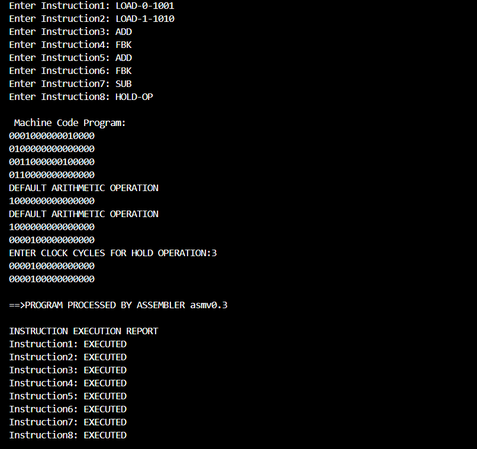

## asm0.3 - Syntax & Primitive Semantic Analysis
🧩 Overview
- In this version, the assembler evolves from a simple instruction-to-machine-code translator into an early-stage compiler system capable of performing syntax validation and primitive semantic checks.
- The assembler now ensures that every assembly instruction follows valid structural rules (syntax) and that operations occur in a meaningful order (basic semantics).

⚙️ Key Features
1. 🧾 Syntax Analysis
  - Each instruction is validated for correct structure and formatting before translation.
  - Detects and reports malformed mnemonics such as:
      - Invalid LOAD structure e.g. missing -S-XXXX pattern.
      - Non-binary selector or data bits.
      - Incorrect instruction length for MUL or other variable-length mnemonics.

      

  
   
  <b>🔍 Syntax Analysis - v0.3</b>
  

2. 🧮 Primitive Semantic Analysis
  - Checks for logical execution order (e.g., preventing arithmetic operations before any data load).
  - Detects invalid machine states (e.g., system reset or override at incorrect times).
  - Ensures the assembler halts gracefully with descriptive error messages.
    
   

  
   
  <b>🕵️ Semantic Analysis - v0.3</b>

3. 🧠 Enhanced Error Reporting
  - Distinct syntax and semantic error messages.
  - Clear differentiation between invalid syntax and invalid semantics.

4. 🔸Detects No Input
   
  

  
   
  <b>🖥️ asmv0.3 — No Input Screen</b>

5. 🧾 Instruction Execution Report
   

  
   
  <b>💾 asmv0.3 - Assembler Output with Instruction Execution Report</b>

## 🚀 Significance
- This version lays the groundwork for transitioning from a translator to a true assembler — introducing language structure, logic, and feedback. It also represents a self-taught implementation of key compiler design concepts that will be formalized in later versions.

